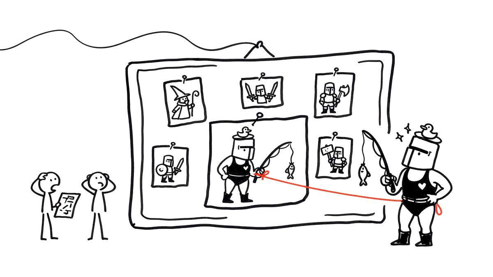

# Лаба 2 · «Опубликуй свой билд»

| | Лаба 1 «Экипировка» | Лаба 2 «Билды» |
|---|---|---|
| Инвариант | **сохранение**: вещей до = вещей после | **изоляция**: опубликованный билд не меняется никогда |
| Что проверять | посчитать до и после | доказать, что **никакая** последовательность действий автора не трогает снимок |
| Глубина графа | инвентарь и слоты, один уровень | игрок → вещи → зачарования → гильдия → 200 игроков |
| Новое | мутация против переприсваивания | **граница копирования**, петли, утечки, слабые ссылки |

Сохранение проверяется арифметикой. Изоляция — нет: чтобы её гарантировать, надо рассуждать обо **всём достижимом графе**.

---

## Тикет

**От Лины:** «Игроки давно просят сделать форум, где можно делиться билдами: выложил свою сборку — другие смотрят и повторяют. Сделали на коленке в прошлом патче, кончилось скандалами.

Первый: игрок выложил билд, через неделю переоделся — и **его старый билд на форуме переоделся вместе с ним**. Люди шли по гайду и не понимали, почему цифры не сходятся.

Второй: Соня посмотрела на графики расхода памяти на сервере. С момента запуска форума сервер ест на четыре гигабайта больше, и график только растёт. Она говорит, что мы там что-то держим и не отпускаем.

Перепиши эту систему. Условия ниже.»

---

## Правила

- **Билд** — снимок экипировки игрока на момент публикации плюс посчитанные характеристики персонажа.
- Опубликованный билд **неизменен**: что бы автор потом ни делал — переоделся, разобрал вещь, снял зачарование, вышел из гильдии, — билд на форуме остаётся тем же.
- Билд помнит **автора** (подпись под гайдом) и **гильдию автора на момент публикации** (тег в подписи).
- Билд можно **форкнуть**: «на основе билда X». У форка всегда есть «родитель», на основе которого сделан форк.
- Форум хранит опубликованные билды, пользователи ставят им лайки, и форум показывает билды по убыванию лайков.

---

## Что уже лежит в репозитории

`world.py` — мир игры, его держит остальной сервер, поэтому не трогай его. Там:

- `Enchantment(name, stat, bonus)`, `Item(name, kind, enchantments)`, `Player(name, level)` с полями `equipment` (список надетых вещей) и `guild`, `Guild(tag)` с `members`, `join` и `leave`;
- `BALANCE` — таблица баланса «вид вещи → характеристика и базовое значение», её меняют патчи;
- `character_stats(items, balance=None)` — характеристики персонажа в этих вещах;
- `make_test_guild()` — тестовая гильдия WOLF: 200 игроков, у каждого 6 вещей, у каждой вещи 3 зачарования. Первый игрок, `ada`, лежит в `guild.members[0]`;
- `remove_from_game(player)` — удалить игрока из игры: выйти из гильдии и снять всё. Ссылки, которые держат на игрока другие системы, она не трогает.

`forum_v0.py` — тот самый форум с прошлого патча. На нём воспроизводятся обе жалобы Лины. Чинить его не надо.

`builds.py` — здесь ты пишешь новый форум. Как устроен `Build` внутри, решаешь ты. Снаружи у билда должны читаться эти поля, на них опираются автопроверки:

| Поле | Что в нём |
|---|---|
| `build.name` | название билда |
| `build.items` | вещи билда, у каждой `name`, `kind`, `enchantments` |
| `build.stats` | характеристики персонажа, словарь как у `character_stats` |
| `build.author` | игрок-автор или `None` (про `None` — пункт 4) |
| `build.author_name` | имя автора, остаётся навсегда |
| `build.guild_tag` | тег гильдии автора на момент публикации или `None` |
| `build.parent` | билд, на основе которого сделан форк, или `None` |

И функции:

| Функция | Что делает |
|---|---|
| `publish(player, name) -> Build` | снимок экипировки игрока |
| `fork(build, player, name) -> Build` | новый билд игрока `player` на основе `build` |
| `ancestry(build) -> list[Build]` | цепочка от самого билда до корня: `[build, родитель, дед, ...]` |
| `Forum().post(build)` | выложить билд |
| `forum.like(build)`, `forum.likes(build)` | поставить лайк, узнать число лайков |
| `forum.top(n) -> list[Build]` | `n` билдов по убыванию лайков |

---

## Задания

### 1. Изоляция

`publish(player, name) -> Build` и `Forum.post(build)`.

Докажите `assert`-ом изоляцию: после публикации делаете с автором **всё, что можно** — меняете список экипировки, меняете поля внутри вещи, добавляете и убираете зачарования, — и билд не должен меняться ни в одном поле.

Минимум четыре проверки: смена экипировки · изменение вещи · изменение **зачарования внутри вещи** · игрок сменил гильдию.

### 2. Граница копирования

Всегда есть соблазн решить всё через `deepcopy`.
Но если замерить расход памяти для такого решения на нашей тестовой гильдии (200 игроков, у каждого 6 вещей, у каждой вещи 3 зачарования):

```
достижимо от игрока, только контейнеры    :  6 402
достижимо, если считать и строки с числами:  7 819
нужно было скопировать                    :     25   (игрок + 6 вещей + 18 зачарований)
перерасход                                : в 256–313 раз
```

`deepcopy(player)` утаскивает гильдию и **все 200 её игроков с их вещами**. Публикация одного билда копирует половину сервера.

Два числа выше — это одни и те же данные, посчитанные разными методами: во втором случае в счёт идут ещё строки и числа. **Метод подсчёта выбираете вы**. Подсказка из лекции: сборщик мусора считает интересными только контейнеры.

Требование: **публикация билда копирует не более 30 объектов** (по вашему методу, на тестовой гильдии). Приведите фактическое число.

Гильдия при этом в билде **должна остаться** — как тег в подписи. Но копировать её нельзя.

### 3. Форки и их обход

`fork(build, player, name) -> Build` и `ancestry(build) -> list[Build]` — цепочка от билда до корня.

Лина редактирует форум руками и уже успела сделать так, что билд оказался собственным предком. Ваш `ancestry` **не должен зависнуть при обходе**:

```
наивный обход: A C B A C B A C B A ...
с отметками  : ['A', 'C', 'B']
```

Решите: отклонять такой форк при создании или обрабатывать при обходе. Оба варианта принимаются с обоснованием.

### 4. Утечка, которую увидела Соня

Форум хранит билды вечно. Билд помнит автора. Значит, **игрок, удалённый из игры, остаётся в памяти навсегда** — вот вам и четыре лишних гигабайта:

```python
p = make_test_guild().members[0]
w = weakref.ref(p)
forum_v0.publish(p, "танк")
remove_from_game(p)
del p; gc.collect()
w()          # <Player ada>   игрок жив
```

Почините так, чтобы удалённый игрок освобождался, а билд на форуме продолжал существовать. Докажите тестом через `weakref` и `gc.collect()`.

Внимание: после этого `build.author` иногда будет `None`. Это **не баг, а новое состояние системы** — будьте готовы объяснить, что показывает форум под билдом удалённого игрока, и покройте это тестом.

### 5. Снимок или живые правила

В следующем патче будет нерф оружия «меч»: было 120 урона, стало 80 (`BALANCE["меч"] = ("урон", 80)`).

Билд, опубликованный до патча, показывает **120** или **80**?

Реализуйте **оба** режима. Сравните по: объёму хранимых данных · сложности кода · тому, что увидит игрок, пришедший по годовалому гайду. Выберите один как основной и защитите выбор.

*Fun Fact: в Path of Building — реальном инструменте для обмена билдами для игры Path of Exile — эта задача не решена окончательно, и каждый крупный патч ломает часть опубликованных сборок. Вы в хорошей компании.*

---

## Как сдавать

Пушим в `main`:

- `builds.py` — решение;
- `test_builds.py` — твои тесты: изоляция (пункт 1), граница копирования с фактическим числом (пункт 2), петля в предках (пункт 3), удалённый игрок (пункт 4), оба режима из пункта 5.

На каждый push прогоняются автопроверки, результат виден во вкладке **Actions** и в релизе `submit/...`. Они закрывают половину баллов за лабу, 3 из 6; вторая половина — защита на паре.
